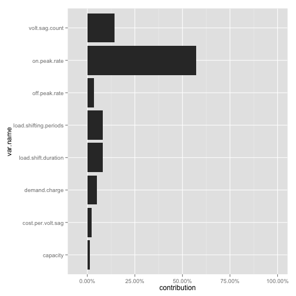
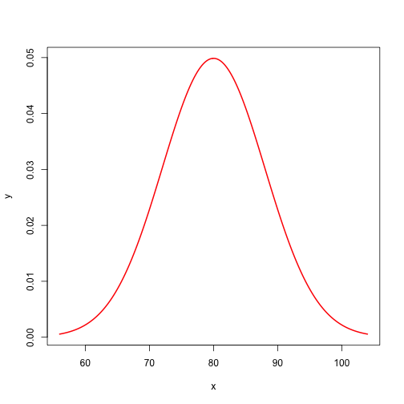
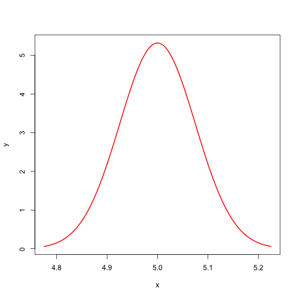
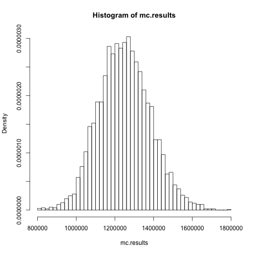

Energy Storage Technology Valuation
========================================================

An R version of the method described in [Energy Storage Technology Valuation Primer](http://www.epri.com/abstracts/Pages/ProductAbstract.aspx?ProductId=000000000001008810) from EPRI.

## Deterministic Model

NPV is calculated in the `npv()` function in `func.r`

Source [here](http://tolstoy.newcastle.edu.au/R/help/05/12/16765.html)

   >t = c(-8000, 100, 100, 100, 2000, 3000, 4000, 5000)

   >r = 0.1

   >npv(r, t)

   >[1] 301.1624


```r
require(plyr)
```

```
## Loading required package: plyr
```

```r
require(pastecs)
```

```
## Loading required package: pastecs
```

```
## Loading required package: boot
```

```r
require(ggplot2)
```

```
## Loading required package: ggplot2
```

```r
require(reshape)
```

```
## Loading required package: reshape
```

```
## Attaching package: 'reshape'
```

```
## The following object(s) are masked from 'package:plyr':
## 
## rename, round_any
```

```r
require(FME)
```

```
## Loading required package: FME
```

```
## Loading required package: deSolve
```

```
## Loading required package: rootSolve
```

```
## Loading required package: minpack.lm
```

```
## Loading required package: MASS
```

```
## Loading required package: coda
```

```
## Loading required package: lattice
```

```
## Attaching package: 'lattice'
```

```
## The following object(s) are masked from 'package:boot':
## 
## melanoma
```

```r
require(xtable)
```

```
## Loading required package: xtable
```

```r
source("~/Code/energy_projects/func.r")
options(scipen = 5)


percentify <- function(x, r = 1, keep.zeros = FALSE) {
    ifelse(as.numeric(x) != 0 | keep.zeros == TRUE, paste(format(round(as.numeric(x) * 
        100, r), nsmall = r), "%", sep = ""), "")
}


inputs <- data.frame(default = c(80, 20, 5, 5, 10, 250, 1e+05, 2))
row.names(inputs) <- c("on.peak.rate", "off.peak.rate", "demand.charge", "capacity", 
    "load.shift.duration", "load.shifting.periods", "cost.per.volt.sag", "volt.sag.count")
inputs$var.name <- row.names(inputs)

# From http://www.tybecenergy.com/pricehistory/pjm_settle.php
on.peak.rate <- 44.4  # $
off.peak.rate <- 31.13  # $


b.total <- calc.benefits(inputs)

sprintf("$%.f", b.total)
```

```
## [1] "$1250000"
```


Now exercise the model for sensitivity analysis


```r

percent(exercise(inputs, "capacity", 1.1)/b.total - 1)
```

```
## [1] "8.40%"
```

```r
percent(exercise(inputs, "on.peak.rate", 1.1)/b.total - 1)
```

```
## [1] "8.00%"
```

```r

df.delta10 <- ddply(inputs, .(var.name), function(x) {
    c(delta10 = (exercise(inputs, x$var.name, 1.1) - b.total)/b.total)
})

df.delta10 <- transform(df.delta10, var.name = reorder(var.name, delta10))

ggplot(df.delta10, aes(var.name, delta10)) + geom_bar(stat = "identity") + coord_flip() + 
    scale_y_continuous(labels = percent, limits = c(-0.05, 0.1))
```

```
## Warning: Stacking not well defined when ymin != 0
```

 


Now examine the change in benefits over a range of different inputs

### Two-Dimensional Data Table, 5MW Energy Storage Example, Total Annual Benefits


```r
on.peak.rate.alt <- c(50, 60, 70, 80, 90, 100)
load.shift.duration.alt <- c(8, 9, 10, 11)

alt.vars <- expand.grid(on.peak.rate.alt = on.peak.rate.alt, load.shift.duration.alt = load.shift.duration.alt)

for (i in 1:nrow(alt.vars)) {
    alt.inputs <- inputs
    alt.inputs["on.peak.rate", "default"] <- alt.vars$on.peak.rate.alt[i]
    alt.inputs["load.shift.duration", "default"] <- alt.vars$load.shift.duration.alt[i]
    alt.vars$benefit[i] <- calc.benefits(alt.inputs)
}
alt.vars
```

```
##    on.peak.rate.alt load.shift.duration.alt benefit
## 1                50                       8  800000
## 2                60                       8  900000
## 3                70                       8 1000000
## 4                80                       8 1100000
## 5                90                       8 1200000
## 6               100                       8 1300000
## 7                50                       9  837500
## 8                60                       9  950000
## 9                70                       9 1062500
## 10               80                       9 1175000
## 11               90                       9 1287500
## 12              100                       9 1400000
## 13               50                      10  875000
## 14               60                      10 1000000
## 15               70                      10 1125000
## 16               80                      10 1250000
## 17               90                      10 1375000
## 18              100                      10 1500000
## 19               50                      11  912500
## 20               60                      11 1050000
## 21               70                      11 1187500
## 22               80                      11 1325000
## 23               90                      11 1462500
## 24              100                      11 1600000
```

```r
cast(alt.vars, on.peak.rate.alt ~ load.shift.duration.alt)
```

```
## Using benefit as value column.  Use the value argument to cast to override
## this choice
```

```
##   on.peak.rate.alt       8       9      10      11
## 1               50  800000  837500  875000  912500
## 2               60  900000  950000 1000000 1050000
## 3               70 1000000 1062500 1125000 1187500
## 4               80 1100000 1175000 1250000 1325000
## 5               90 1200000 1287500 1375000 1462500
## 6              100 1300000 1400000 1500000 1600000
```


### Two-Dimensional Data Table, 10MW Energy Storage Example, Total Annual Benefits


```r
alt.inputs <- inputs
alt.inputs["capacity", "default"] <- 10
on.peak.rate.alt <- c(50, 60, 70, 80, 90, 100)
load.shift.duration.alt <- c(8, 9, 10, 11)

alt.vars <- expand.grid(on.peak.rate.alt = on.peak.rate.alt, load.shift.duration.alt = load.shift.duration.alt)

for (i in 1:nrow(alt.vars)) {
    alt.inputs["on.peak.rate", "default"] <- alt.vars$on.peak.rate.alt[i]
    alt.inputs["load.shift.duration", "default"] <- alt.vars$load.shift.duration.alt[i]
    alt.vars$benefit[i] <- calc.benefits(alt.inputs)
}
alt.vars
```

```
##    on.peak.rate.alt load.shift.duration.alt benefit
## 1                50                       8 1400000
## 2                60                       8 1600000
## 3                70                       8 1800000
## 4                80                       8 2000000
## 5                90                       8 2200000
## 6               100                       8 2400000
## 7                50                       9 1475000
## 8                60                       9 1700000
## 9                70                       9 1925000
## 10               80                       9 2150000
## 11               90                       9 2375000
## 12              100                       9 2600000
## 13               50                      10 1550000
## 14               60                      10 1800000
## 15               70                      10 2050000
## 16               80                      10 2300000
## 17               90                      10 2550000
## 18              100                      10 2800000
## 19               50                      11 1625000
## 20               60                      11 1900000
## 21               70                      11 2175000
## 22               80                      11 2450000
## 23               90                      11 2725000
## 24              100                      11 3000000
```

```r
cast(alt.vars, on.peak.rate.alt ~ load.shift.duration.alt)
```

```
## Using benefit as value column.  Use the value argument to cast to override
## this choice
```

```
##   on.peak.rate.alt       8       9      10      11
## 1               50 1400000 1475000 1550000 1625000
## 2               60 1600000 1700000 1800000 1900000
## 3               70 1800000 1925000 2050000 2175000
## 4               80 2000000 2150000 2300000 2450000
## 5               90 2200000 2375000 2550000 2725000
## 6              100 2400000 2600000 2800000 3000000
```


## Estimating Uncertainty

### Example 2 -- Calculating Total Uncertainty for Energy Storage Annual Savings

#### Table 3-3

#### Nominal Values for Energy Storage Example


```r
print(xtable(inputs), type = "html")
```

<!-- html table generated in R 2.15.2 by xtable 1.7-0 package -->
<!-- Fri Jul 19 13:07:01 2013 -->
<TABLE border=1>
<TR> <TH>  </TH> <TH> default </TH> <TH> var.name </TH>  </TR>
  <TR> <TD align="right"> on.peak.rate </TD> <TD align="right"> 80.00 </TD> <TD> on.peak.rate </TD> </TR>
  <TR> <TD align="right"> off.peak.rate </TD> <TD align="right"> 20.00 </TD> <TD> off.peak.rate </TD> </TR>
  <TR> <TD align="right"> demand.charge </TD> <TD align="right"> 5.00 </TD> <TD> demand.charge </TD> </TR>
  <TR> <TD align="right"> capacity </TD> <TD align="right"> 5.00 </TD> <TD> capacity </TD> </TR>
  <TR> <TD align="right"> load.shift.duration </TD> <TD align="right"> 10.00 </TD> <TD> load.shift.duration </TD> </TR>
  <TR> <TD align="right"> load.shifting.periods </TD> <TD align="right"> 250.00 </TD> <TD> load.shifting.periods </TD> </TR>
  <TR> <TD align="right"> cost.per.volt.sag </TD> <TD align="right"> 100000.00 </TD> <TD> cost.per.volt.sag </TD> </TR>
  <TR> <TD align="right"> volt.sag.count </TD> <TD align="right"> 2.00 </TD> <TD> volt.sag.count </TD> </TR>
   </TABLE>


```r
inputs$uncertainty.pct <- c(0.2, 0.2, 0.2, 0.03, 0.1, 0.1, 0.2, 0.5)
inputs$uncertainty.abs <- inputs$default * inputs$uncertainty.pct
inputs$low <- inputs$default - inputs$uncertainty.abs
inputs$high <- inputs$default + inputs$uncertainty.abs
```


#### Table 3-4

#### Uncertainty Estimates for Energy Storage Example

```r
print(xtable(inputs), type = "html")
```

<!-- html table generated in R 2.15.2 by xtable 1.7-0 package -->
<!-- Fri Jul 19 13:07:01 2013 -->
<TABLE border=1>
<TR> <TH>  </TH> <TH> default </TH> <TH> var.name </TH> <TH> uncertainty.pct </TH> <TH> uncertainty.abs </TH> <TH> low </TH> <TH> high </TH>  </TR>
  <TR> <TD align="right"> on.peak.rate </TD> <TD align="right"> 80.00 </TD> <TD> on.peak.rate </TD> <TD align="right"> 0.20 </TD> <TD align="right"> 16.00 </TD> <TD align="right"> 64.00 </TD> <TD align="right"> 96.00 </TD> </TR>
  <TR> <TD align="right"> off.peak.rate </TD> <TD align="right"> 20.00 </TD> <TD> off.peak.rate </TD> <TD align="right"> 0.20 </TD> <TD align="right"> 4.00 </TD> <TD align="right"> 16.00 </TD> <TD align="right"> 24.00 </TD> </TR>
  <TR> <TD align="right"> demand.charge </TD> <TD align="right"> 5.00 </TD> <TD> demand.charge </TD> <TD align="right"> 0.20 </TD> <TD align="right"> 1.00 </TD> <TD align="right"> 4.00 </TD> <TD align="right"> 6.00 </TD> </TR>
  <TR> <TD align="right"> capacity </TD> <TD align="right"> 5.00 </TD> <TD> capacity </TD> <TD align="right"> 0.03 </TD> <TD align="right"> 0.15 </TD> <TD align="right"> 4.85 </TD> <TD align="right"> 5.15 </TD> </TR>
  <TR> <TD align="right"> load.shift.duration </TD> <TD align="right"> 10.00 </TD> <TD> load.shift.duration </TD> <TD align="right"> 0.10 </TD> <TD align="right"> 1.00 </TD> <TD align="right"> 9.00 </TD> <TD align="right"> 11.00 </TD> </TR>
  <TR> <TD align="right"> load.shifting.periods </TD> <TD align="right"> 250.00 </TD> <TD> load.shifting.periods </TD> <TD align="right"> 0.10 </TD> <TD align="right"> 25.00 </TD> <TD align="right"> 225.00 </TD> <TD align="right"> 275.00 </TD> </TR>
  <TR> <TD align="right"> cost.per.volt.sag </TD> <TD align="right"> 100000.00 </TD> <TD> cost.per.volt.sag </TD> <TD align="right"> 0.20 </TD> <TD align="right"> 20000.00 </TD> <TD align="right"> 80000.00 </TD> <TD align="right"> 120000.00 </TD> </TR>
  <TR> <TD align="right"> volt.sag.count </TD> <TD align="right"> 2.00 </TD> <TD> volt.sag.count </TD> <TD align="right"> 0.50 </TD> <TD align="right"> 1.00 </TD> <TD align="right"> 1.00 </TD> <TD align="right"> 3.00 </TD> </TR>
   </TABLE>


#### Eq. 3-3

Vary each input by 1% and measure the change in output


```r

alt.inputs <- inputs[, c("default", "var.name", "uncertainty.abs")]


varied <- ddply(alt.inputs, .(var.name, uncertainty.abs), function(x) c(value = x$default, 
    sensitivity = calc.sensitivity(alt.inputs, x$var.name, 1.01)))
varied$km <- (varied$uncertainty.abs * varied$sensitivity)^2

varied
```

```
##                var.name uncertainty.abs  value sensitivity          km
## 1              capacity            0.15      5      210000   992250000
## 2     cost.per.volt.sag        20000.00 100000           2  1600000000
## 3         demand.charge            1.00      5       60000  3600000000
## 4   load.shift.duration            1.00     10       75000  5625000000
## 5 load.shifting.periods           25.00    250        3000  5625000000
## 6         off.peak.rate            4.00     20      -12500  2500000000
## 7          on.peak.rate           16.00     80       12500 40000000000
## 8        volt.sag.count            1.00      2      100000 10000000000
```

```r

varied <- ddply(varied, .(), transform, contribution = km/sum(km))
varied$contribution.pct <- percentify(varied$contribution)
```


#### Table 3-5

#### Uncertainty Analysis, Energy Storage Example


```r
print(xtable(varied), type = "html")
```

<!-- html table generated in R 2.15.2 by xtable 1.7-0 package -->
<!-- Fri Jul 19 13:07:01 2013 -->
<TABLE border=1>
<TR> <TH>  </TH> <TH> .id </TH> <TH> var.name </TH> <TH> uncertainty.abs </TH> <TH> value </TH> <TH> sensitivity </TH> <TH> km </TH> <TH> contribution </TH> <TH> contribution.pct </TH>  </TR>
  <TR> <TD align="right"> 1 </TD> <TD>  </TD> <TD> capacity </TD> <TD align="right"> 0.15 </TD> <TD align="right"> 5.00 </TD> <TD align="right"> 210000.00 </TD> <TD align="right"> 992250000.00 </TD> <TD align="right"> 0.01 </TD> <TD>  1.4% </TD> </TR>
  <TR> <TD align="right"> 2 </TD> <TD>  </TD> <TD> cost.per.volt.sag </TD> <TD align="right"> 20000.00 </TD> <TD align="right"> 100000.00 </TD> <TD align="right"> 2.00 </TD> <TD align="right"> 1600000000.00 </TD> <TD align="right"> 0.02 </TD> <TD>  2.3% </TD> </TR>
  <TR> <TD align="right"> 3 </TD> <TD>  </TD> <TD> demand.charge </TD> <TD align="right"> 1.00 </TD> <TD align="right"> 5.00 </TD> <TD align="right"> 60000.00 </TD> <TD align="right"> 3600000000.00 </TD> <TD align="right"> 0.05 </TD> <TD>  5.1% </TD> </TR>
  <TR> <TD align="right"> 4 </TD> <TD>  </TD> <TD> load.shift.duration </TD> <TD align="right"> 1.00 </TD> <TD align="right"> 10.00 </TD> <TD align="right"> 75000.00 </TD> <TD align="right"> 5625000000.00 </TD> <TD align="right"> 0.08 </TD> <TD>  8.0% </TD> </TR>
  <TR> <TD align="right"> 5 </TD> <TD>  </TD> <TD> load.shifting.periods </TD> <TD align="right"> 25.00 </TD> <TD align="right"> 250.00 </TD> <TD align="right"> 3000.00 </TD> <TD align="right"> 5625000000.00 </TD> <TD align="right"> 0.08 </TD> <TD>  8.0% </TD> </TR>
  <TR> <TD align="right"> 6 </TD> <TD>  </TD> <TD> off.peak.rate </TD> <TD align="right"> 4.00 </TD> <TD align="right"> 20.00 </TD> <TD align="right"> -12500.00 </TD> <TD align="right"> 2500000000.00 </TD> <TD align="right"> 0.04 </TD> <TD>  3.6% </TD> </TR>
  <TR> <TD align="right"> 7 </TD> <TD>  </TD> <TD> on.peak.rate </TD> <TD align="right"> 16.00 </TD> <TD align="right"> 80.00 </TD> <TD align="right"> 12500.00 </TD> <TD align="right"> 40000000000.00 </TD> <TD align="right"> 0.57 </TD> <TD> 57.2% </TD> </TR>
  <TR> <TD align="right"> 8 </TD> <TD>  </TD> <TD> volt.sag.count </TD> <TD align="right"> 1.00 </TD> <TD align="right"> 2.00 </TD> <TD align="right"> 100000.00 </TD> <TD align="right"> 10000000000.00 </TD> <TD align="right"> 0.14 </TD> <TD> 14.3% </TD> </TR>
   </TABLE>

```r

cat("Total Uncertainty: ", sprintf("$%.0f", sum(varied$km)^0.5))
```

Total Uncertainty:  $264466


#### Figure 3-3

#### Uncertainty Analysis, Energy Storage System

```r
ggplot(varied, aes(var.name, contribution)) + geom_bar(stat = "identity") + 
    coord_flip() + scale_y_continuous(labels = percent, limits = c(-0.05, 1))
```

 


Run the scenario again, with the assumption of 10% uncertainty for On-Peak Energy rate.

#### Table 3-6

#### Uncertainty Analysis Energy Storage Example, Reducing the On-Peak Energy Rate Uncertainty Assumption from +/- 20% to +/- 10%


```r
inputs.b <- inputs
inputs.b["on.peak.rate", "uncertainty.pct"] <- 0.1
inputs.b$uncertainty.abs <- inputs.b$default * inputs.b$uncertainty.pct

varied.b <- ddply(inputs.b, .(var.name, uncertainty.abs), function(x) c(value = x$default, 
    sensitivity = calc.sensitivity(inputs.b, x$var.name, 1.01)))

varied.b$km <- (varied.b$uncertainty.abs * varied.b$sensitivity)^2

varied.b <- ddply(varied.b, .(), transform, contribution = km/sum(km))
varied.b$contribution.pct <- percentify(varied.b$contribution)
print(xtable(varied.b), type = "html")
```

<!-- html table generated in R 2.15.2 by xtable 1.7-0 package -->
<!-- Fri Jul 19 13:07:01 2013 -->
<TABLE border=1>
<TR> <TH>  </TH> <TH> .id </TH> <TH> var.name </TH> <TH> uncertainty.abs </TH> <TH> value </TH> <TH> sensitivity </TH> <TH> km </TH> <TH> contribution </TH> <TH> contribution.pct </TH>  </TR>
  <TR> <TD align="right"> 1 </TD> <TD>  </TD> <TD> capacity </TD> <TD align="right"> 0.15 </TD> <TD align="right"> 5.00 </TD> <TD align="right"> 210000.00 </TD> <TD align="right"> 992250000.00 </TD> <TD align="right"> 0.02 </TD> <TD>  2.5% </TD> </TR>
  <TR> <TD align="right"> 2 </TD> <TD>  </TD> <TD> cost.per.volt.sag </TD> <TD align="right"> 20000.00 </TD> <TD align="right"> 100000.00 </TD> <TD align="right"> 2.00 </TD> <TD align="right"> 1600000000.00 </TD> <TD align="right"> 0.04 </TD> <TD>  4.0% </TD> </TR>
  <TR> <TD align="right"> 3 </TD> <TD>  </TD> <TD> demand.charge </TD> <TD align="right"> 1.00 </TD> <TD align="right"> 5.00 </TD> <TD align="right"> 60000.00 </TD> <TD align="right"> 3600000000.00 </TD> <TD align="right"> 0.09 </TD> <TD>  9.0% </TD> </TR>
  <TR> <TD align="right"> 4 </TD> <TD>  </TD> <TD> load.shift.duration </TD> <TD align="right"> 1.00 </TD> <TD align="right"> 10.00 </TD> <TD align="right"> 75000.00 </TD> <TD align="right"> 5625000000.00 </TD> <TD align="right"> 0.14 </TD> <TD> 14.1% </TD> </TR>
  <TR> <TD align="right"> 5 </TD> <TD>  </TD> <TD> load.shifting.periods </TD> <TD align="right"> 25.00 </TD> <TD align="right"> 250.00 </TD> <TD align="right"> 3000.00 </TD> <TD align="right"> 5625000000.00 </TD> <TD align="right"> 0.14 </TD> <TD> 14.1% </TD> </TR>
  <TR> <TD align="right"> 6 </TD> <TD>  </TD> <TD> off.peak.rate </TD> <TD align="right"> 4.00 </TD> <TD align="right"> 20.00 </TD> <TD align="right"> -12500.00 </TD> <TD align="right"> 2500000000.00 </TD> <TD align="right"> 0.06 </TD> <TD>  6.3% </TD> </TR>
  <TR> <TD align="right"> 7 </TD> <TD>  </TD> <TD> on.peak.rate </TD> <TD align="right"> 8.00 </TD> <TD align="right"> 80.00 </TD> <TD align="right"> 12500.00 </TD> <TD align="right"> 10000000000.00 </TD> <TD align="right"> 0.25 </TD> <TD> 25.0% </TD> </TR>
  <TR> <TD align="right"> 8 </TD> <TD>  </TD> <TD> volt.sag.count </TD> <TD align="right"> 1.00 </TD> <TD align="right"> 2.00 </TD> <TD align="right"> 100000.00 </TD> <TD align="right"> 10000000000.00 </TD> <TD align="right"> 0.25 </TD> <TD> 25.0% </TD> </TR>
   </TABLE>

```r

cat("Total Uncertainty: ", sprintf("$%.0f", sum(varied.b$km)^0.5))
```

Total Uncertainty:  $199856


## 4

## Monte Carlo Modeling

Assign standard deviations to the inputs

```r
inputs$sd <- (inputs$default * inputs$uncertainty.pct)/2
```


#### Figure 4-1

#### Assumed Probability Distribution, On-Peak Energy Rate


```r
x = seq(56, 104, length = 200)
y = dnorm(x, mean = 80, sd = 8)
plot(x, y, type = "l", lwd = 2, col = "red")
```

 

#### Figure 4-2

#### Assumed Probability Distribution, System Size


```r
x = seq(4.775, 5.225, length = 200)
y = dnorm(x, mean = 5, sd = 0.075)
plot(x, y, type = "l", lwd = 2, col = "red")
```

 


#### Table 4-1

#### Monte Carlo Model Inputs, Energy Storage Example


```r
print(xtable(inputs[, c("var.name", "default", "uncertainty.abs")]), type = "html")
```

<!-- html table generated in R 2.15.2 by xtable 1.7-0 package -->
<!-- Fri Jul 19 13:07:02 2013 -->
<TABLE border=1>
<TR> <TH>  </TH> <TH> var.name </TH> <TH> default </TH> <TH> uncertainty.abs </TH>  </TR>
  <TR> <TD align="right"> on.peak.rate </TD> <TD> on.peak.rate </TD> <TD align="right"> 80.00 </TD> <TD align="right"> 16.00 </TD> </TR>
  <TR> <TD align="right"> off.peak.rate </TD> <TD> off.peak.rate </TD> <TD align="right"> 20.00 </TD> <TD align="right"> 4.00 </TD> </TR>
  <TR> <TD align="right"> demand.charge </TD> <TD> demand.charge </TD> <TD align="right"> 5.00 </TD> <TD align="right"> 1.00 </TD> </TR>
  <TR> <TD align="right"> capacity </TD> <TD> capacity </TD> <TD align="right"> 5.00 </TD> <TD align="right"> 0.15 </TD> </TR>
  <TR> <TD align="right"> load.shift.duration </TD> <TD> load.shift.duration </TD> <TD align="right"> 10.00 </TD> <TD align="right"> 1.00 </TD> </TR>
  <TR> <TD align="right"> load.shifting.periods </TD> <TD> load.shifting.periods </TD> <TD align="right"> 250.00 </TD> <TD align="right"> 25.00 </TD> </TR>
  <TR> <TD align="right"> cost.per.volt.sag </TD> <TD> cost.per.volt.sag </TD> <TD align="right"> 100000.00 </TD> <TD align="right"> 20000.00 </TD> </TR>
  <TR> <TD align="right"> volt.sag.count </TD> <TD> volt.sag.count </TD> <TD align="right"> 2.00 </TD> <TD align="right"> 1.00 </TD> </TR>
   </TABLE>


Run multiple iterations across the input distributions

#### Figure 4-3
#### Monte Carlo Simulation, Frequency Distribution for Total Annual Benefits
Corresponds to Figures 4-3 and 4-4 in the source document


```r

mc.results <- mc.benefits(inputs, 5000)

t.test(mc.results, conf.level = 0.95)
```

```
## 
## 	One Sample t-test
## 
## data:  mc.results 
## t = 662, df = 4999, p-value < 2.2e-16
## alternative hypothesis: true mean is not equal to 0 
## 95 percent confidence interval:
##  1243225 1250610 
## sample estimates:
## mean of x 
##   1246918
```

```r

hist(mc.results, freq = FALSE, breaks = 50)
```

 

```r
data.frame(stat.desc(mc.results))
```

```
##              stat.desc.mc.results.
## nbr.val                  5.000e+03
## nbr.null                 0.000e+00
## nbr.na                   0.000e+00
## min                      8.436e+05
## max                      1.755e+06
## range                    9.110e+05
## sum                      6.235e+09
## median                   1.245e+06
## mean                     1.247e+06
## SE.mean                  1.884e+03
## CI.mean.0.95             3.693e+03
## var                      1.774e+10
## std.dev                  1.332e+05
## coef.var                 1.068e-01
```

```r

# Uncertainty:
cat("$", format(stat.desc(mc.results)["std.dev"] * 2, nsmall = 2, big.mark = ","), 
    sep = "")
```

```
## $266,379.58
```

```r


varied.mc <- ddply(inputs, .(var.name, uncertainty.abs), function(x) c(value = x$default, 
    sensitivity = calc.sensitivity.mc(inputs, x$var.name, 1.01, 5000)))

varied.mc$km <- (varied.mc$uncertainty.abs * varied.mc$sensitivity)^2
varied.mc <- ddply(varied.mc, .(), transform, contribution = km/sum(km))
varied.mc$contribution.pct <- percentify(varied.mc$contribution)

varied.mc[, c("var.name", "contribution.pct")]
```

```
##                var.name contribution.pct
## 1              capacity             1.4%
## 2     cost.per.volt.sag             1.0%
## 3         demand.charge             3.6%
## 4   load.shift.duration            12.8%
## 5 load.shifting.periods            13.8%
## 6         off.peak.rate             0.1%
## 7          on.peak.rate            39.5%
## 8        volt.sag.count            27.8%
```


